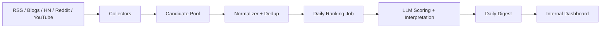

# 架构设计

## 模块边界

### Collector

负责把不同来源转成统一候选内容结构。每个来源一个 adapter，不在 adapter 内做最终排序。

输出字段：

- 标题
- 摘要或正文片段
- 来源
- 原始链接
- 发布时间
- 外部 ID
- 互动数据
- 原始 payload

### Normalizer

负责清洗和去重：

- URL canonicalize。
- 标题相似度初筛。
- 同一事件多源报道合并。
- 保留主要来源和补充来源。

### Ranking

每天固定时间读取过去 24 小时候选池，构造受约束 prompt，让 LLM 输出结构化 JSON：

- 候选 ID
- 影响力分
- 热度信号解释
- 最终排名
- 1-2 句解读

排序 prompt 必须要求「只基于输入材料」，禁止补充未提供事实。

### Digest Publisher

负责把 LLM 结果落库为当天每日精选。生成失败时保留 LLM run 记录和错误，便于重跑。

### Web

首页展示当天 digest；历史页按日期读取 digest；管理员页面维护 source、关键词和调度配置。

## 数据流

## 失败处理

- 单个数据源失败不影响其他数据源。
- 每次采集记录 source、开始时间、结束时间、成功/失败和错误摘要。
- 每日精选生成失败不覆盖前一天结果。
- LLM 输出必须做 schema 校验，不合格则记录失败并允许重跑。
