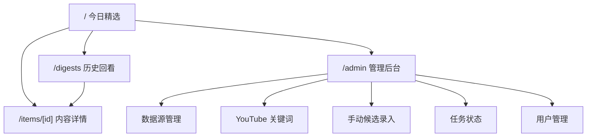
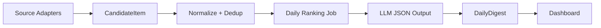

# AI 行业情报聚合平台设计方案

## 设计结论

MVP 做成一个安静、可扫描、面向团队日常阅读的内部工作台。首页不是营销页，也不是复杂数据大屏，而是一份当天已经排好序的「每日精选」。团队成员打开页面后，应在 1 分钟内知道今天最值得关注的 10-20 条 AI / 大模型动态，并能继续点进原文。

默认产品决策：

- 每日生成时间：08:00。
- MVP 数据源：RSS / 官方博客 / Hacker News / Reddit / YouTube。
- MVP 不接入 Twitter/X 自动采集，保留 Phase 2 插槽。
- 抖音 / 小红书在 MVP 只支持人工录入候选，不做自动抓取。
- 角色：管理员和只读成员。
- 生成后提醒：预留企业微信机器人接口，MVP 可先手动访问。

## 用户角色

### 只读成员

目标是快速阅读每日精选，不配置系统。

可用能力：

- 查看今天精选。
- 按日期回看历史精选。
- 搜索历史标题、来源和 AI 解读。
- 打开原文链接。

### 管理员

目标是维护数据源和保证每日精选稳定生成。

可用能力：

- 管理 RSS / 官方博客 / YouTube 关键词。
- 手动录入候选内容。
- 查看采集任务状态。
- 触发每日精选重跑。
- 管理账号和角色。

## 页面结构

### 1. 今日精选页

路径：`/`

页面重点：

- 顶部显示日期、生成时间、候选池数量和精选数量。
- 主体为统一排序列表，不按来源分区。
- 每条内容包含排名、标题、来源、发布时间、来源类型、热度信号、AI 解读和原文链接。
- 若当天还未生成，显示「等待今日精选生成」状态和最近一次成功生成日期。

卡片字段：

- `rank`: 排名。
- `title`: 标题。
- `source`: 来源名称。
- `publishedAt`: 发布时间。
- `sourceType`: RSS / Blog / HN / Reddit / YouTube / Manual。
- `interpretation`: 1-2 句 AI 解读。
- `signals`: 影响力与热度信号摘要。
- `url`: 原文链接。

### 2. 历史回看页

路径：`/digests`

页面重点：

- 左侧或顶部日期选择。
- 默认按最近日期倒序。
- 每天显示生成状态、精选数量、候选数量。
- 点击日期进入该日精选详情。

### 3. 内容详情页

路径：`/items/[id]`

页面重点：

- 展示候选内容原始摘要、来源、采集时间、互动数据和所属 digest。
- 展示该内容被选中的原因和 LLM 输出信号。
- 多源重复报道合并后，显示补充来源。

### 4. 管理后台

路径：`/admin`

管理后台不做复杂运营系统，只覆盖 MVP 必要维护。

页面模块：

- 数据源管理：启用/停用、抓取间隔、RSS URL、来源类型。
- YouTube 关键词：关键词、语言/地区、最大结果数、启用状态。
- 手动候选录入：标题、摘要、来源、URL、发布时间。
- 任务状态：最近采集结果、每日生成结果、错误摘要。
- 用户管理：邮箱、角色、启用状态。

## 信息架构

## 数据链路设计

### 采集

每个来源实现独立 adapter，统一输出 `CandidateItem`。adapter 不做最终排序，只负责抓取、清洗基础字段和保存原始 payload。

### 去重

MVP 用三层去重：

1. `canonicalUrl` 唯一约束。
2. `sourceId + externalId` 作为来源内稳定 ID。
3. 标题归一化后做相似度初筛，同一事件可归并到主候选。

### 每日排序

每天 08:00 读取过去 24 小时候选池，由 LLM 进行结构化排序。Prompt 必须限制模型只基于输入材料输出，不允许补充未提供事实。

输出结构：

- `candidateId`
- `rank`
- `score`
- `impactReason`
- `heatReason`
- `interpretation`

### 发布

生成成功后写入 `DailyDigest` 和 `DigestItem`。如果当天已经存在 digest，重跑时创建新的 LLM run 记录，并替换该日 digest items，避免重复展示。

## 排序规则

推荐权重不硬编码成固定数学公式，而是给 LLM 提供明确判断框架：

- 影响力：重大模型发布、能力变化、生态规则变化、头部公司战略动作、开发者工具变化。
- 社区热度：播放量、点赞、评论、转发、HN 分数、Reddit 评论量。
- 新鲜度：过去 24 小时优先，但重大事件允许覆盖较晚发布的低价值内容。
- 多源报道：同一事件被多个可信来源报道时提高可信度和重要性。
- 内容约束：AI 解读只能解释该内容为何重要，不写投资建议、竞品判断或未给出事实。

## 视觉与交互风格

这是一套内部工作台，视觉应克制、信息密度适中、便于扫读。

设计原则：

- 首页第一屏直接出现今日精选，不做大幅 hero。
- 使用中性色背景、清晰边框、有限强调色。
- 卡片半径不超过 8px。
- 排名、来源、时间、热度信号要稳定对齐。
- 管理后台采用表格、表单、开关和状态徽标，不使用装饰性大图。
- 移动端保留可读性，但优先优化桌面阅读。

建议布局：

- 桌面端：内容区最大宽度 1120px，列表单列。
- 列表项：左侧排名，中间标题和解读，右侧来源/时间/操作。
- 管理页：顶部 tabs，表格密度中等。

## 方案对比

### 方案 A：单体 Next.js 工作台

优点：

- 最快交付 MVP。
- 前端、API、认证和页面在一个项目内，部署简单。
- 适合 SQLite 和团队内部使用。

缺点：

- 后续任务量变大时，需要把采集任务逐步拆出去。

结论：推荐。

### 方案 B：前后端分离

优点：

- 长期边界清晰。
- 多客户端扩展更自然。

缺点：

- MVP 过重，部署和接口维护成本更高。

结论：不适合第一阶段。

### 方案 C：先做静态日报生成器

优点：

- 极简，开发快。

缺点：

- 历史回看、数据源管理和重跑能力很快会受限。

结论：只适合临时验证，不适合作为正式 MVP。

## MVP 验收标准

1. 管理员可配置至少 5 个 RSS / 官方博客来源和 3 个 YouTube 关键词。
2. 采集任务可手动执行，成功写入候选池。
3. 相同 URL 不会重复入库。
4. 每日生成任务可产出 10-20 条精选。
5. 每条精选有标题、来源、链接和 1-2 句 AI 解读。
6. 首页展示当天精选。
7. 历史页可以回看指定日期。
8. 当前版本开放预览，无需登录即可访问首页、历史页、管理后台和开发进度页。
9. 管理员可以查看最近任务错误。
10. `pnpm lint`、`pnpm typecheck`、`pnpm build` 全部通过。

## 实施分期

### Phase 1.1：内部可运行骨架

- 开放预览访问，登录和 session 代码保留但不启用。
- 数据源表、候选池表、每日精选表。
- 今日精选页和历史页。
- 管理后台基础入口。
- 开发进度页。

### Phase 1.2：采集闭环

- RSS adapter。
- YouTube adapter。
- 手动候选录入。
- 采集任务日志。

### Phase 1.3：每日精选闭环

- LLM prompt。
- JSON schema 校验。
- 每日 digest 生成。
- 重跑机制。

### Phase 1.4：部署与运行

- Windows / WSL2 调度说明。
- Caddy 反向代理配置说明。
- 生产环境变量清单。
- 基础备份策略。

## 不进入 MVP 的内容

- Twitter/X 自动采集。
- 抖音 / 小红书自动全站热点监测。
- 客户对外访问。
- 深度研判报告。
- 多租户。
- 企业 SSO。
